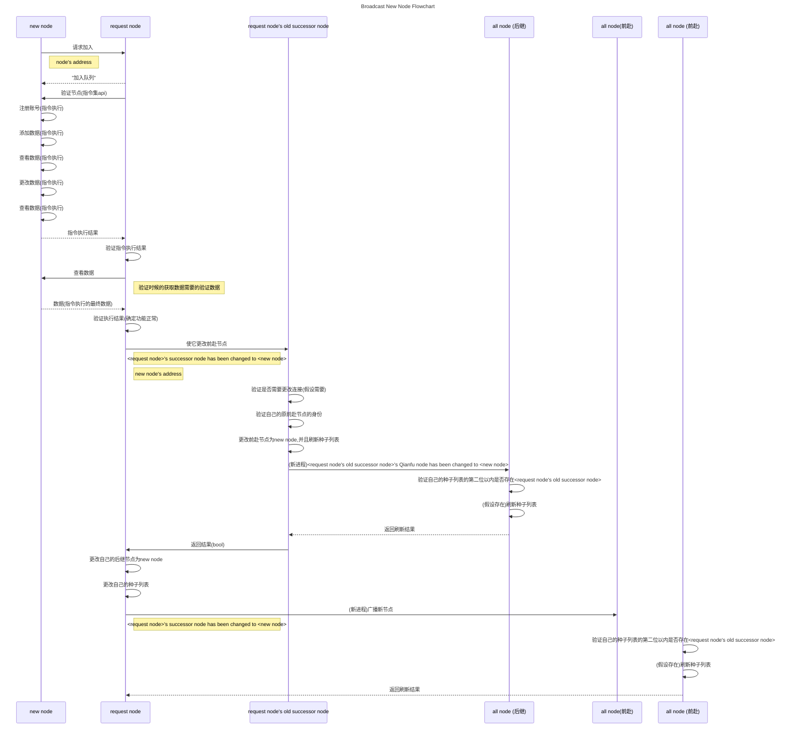

```mermaid
sequenceDiagram
	Title: Broadcast New Node Flowchart
	
    participant new node
    participant request node
    participant request node's old successor node

    new node ->> request node:请求加入
    Note right of new node:node's address
    request node -->> new node:"加入队列"
    request node ->> new node:验证节点(指令集api)
    new node ->> new node:注册账号(指令执行)
    new node ->> new node:添加数据(指令执行)
    new node ->> new node:查看数据(指令执行)
    new node ->> new node:更改数据(指令执行)
    new node ->> new node:查看数据(指令执行)
    new node -->> request node:指令执行结果
    request node ->> request node:验证指令执行结果
    request node ->> new node:查看数据
    Note right of request node:验证时候的获取数据需要的验证数据
    new node -->> request node:数据(指令执行的最终数据)
    request node ->> request node:验证执行结果(确定功能正常)
    request node ->> request node's old successor node:使它更改前赴节点
    Note right of request node:<request node>'s successor node has been changed to <new node>
    Note right of request node:new node's address
    request node's old successor node ->> request node's old successor node:验证是否需要更改连接(假设需要)
    request node's old successor node ->> request node's old successor node:验证自己的原前赴节点的身份
    request node's old successor node ->> request node's old successor node:更改前赴节点为new node,并且刷新种子列表
    request node's old successor node ->> all node (后继):(新进程)<request node's old successor node>'s Qianfu node has been changed to <new node>
    all node (后继) ->> all node (后继):验证自己的种子列表的第二位以内是否存在<request node's old successor node>
    all node (后继) ->> all node (后继):(假设存在)刷新种子列表
    all node (后继) -->> request node's old successor node:返回刷新结果
    request node's old successor node ->> request node:返回结果(bool)

    request node ->> request node:更改自己的后继节点为new node
    request node ->> request node:更改自己的种子列表

    request node ->> all node(前赴):(新进程)广播新节点
    Note right of request node:<request node>'s successor node has been changed to <new node>
    
    all node (前赴) ->> all node (前赴):验证自己的种子列表的第二位以内是否存在<request node's old successor node>
    all node (前赴) ->> all node (前赴):(假设存在)刷新种子列表
    all node (前赴) -->> request node:返回刷新结果
```